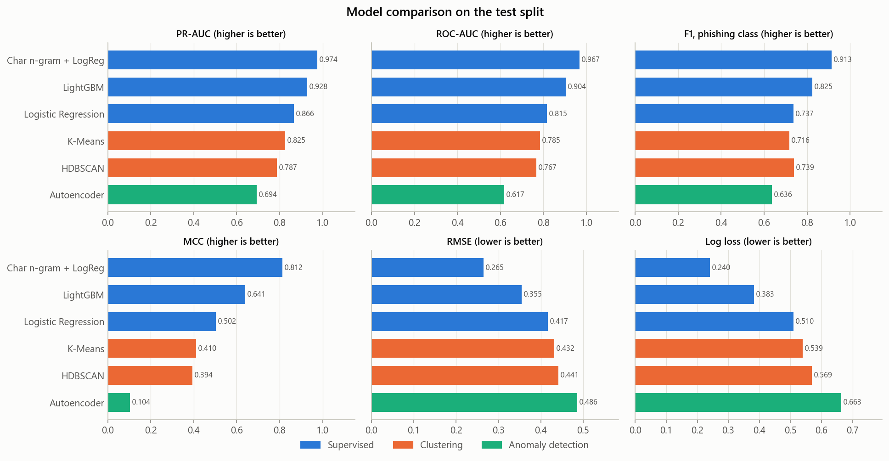

# Model Comparison - Phishing URL Detector

Source: `scripts/compare_models.py`. Every saved model scored on the same domain-grouped test split (332769 rows, phishing share 54.03%) with the same metrics.

## Summary of findings

- Best by PR-AUC: Char n-gram + LogReg (0.9742), also best mean rank across all metrics: Char n-gram + LogReg.
- Best of each family by PR-AUC: Anomaly detection: Autoencoder (0.6936); Clustering: K-Means (0.8246); Supervised: Char n-gram + LogReg (0.9742).
- Char n-gram + LogReg is best on all 15 metrics.

## Models

| Model | Family | Input | Trained by |
|---|---|---|---|
| LightGBM | Supervised | 21 URL features incl. `tld` | `train_model.py` |
| Logistic Regression | Supervised | 21 URL features incl. `tld` | `train_model.py` |
| Char n-gram + LogReg | Supervised | raw URL, 3-5 char n-grams | `train_char_ngram.py` |
| K-Means | Clustering (label used only to score clusters) | 20 numeric URL features | `clustering_model.py` |
| HDBSCAN | Clustering (label used only to score clusters) | 20 numeric URL features | `clustering_model.py` |
| Autoencoder | Anomaly detection (trained on legitimate URLs only) | 20 numeric URL features | `autoencoder_model.py` |

## Test results

Sorted by PR-AUC. Threshold-based metrics use each model's probability at 0.5; `precision`, `recall` and `f1` are for the phishing class, `macro_f1` averages F1 over both classes. `recall_at_1pct_fpr` is the share of phishing URLs caught when 1% of legitimate URLs are flagged. `mae`, `mse_brier`, `rmse` and `log_loss` measure the probability error (lower is better). `mean_rank` is the model's average rank over all metrics (1 = best).

|                      | family            |   mean_rank |   precision |   recall |     f1 |   macro_f1 |   accuracy |   specificity |   balanced_accuracy |    mcc |    mae |   mse_brier |   rmse |   log_loss |   roc_auc |   pr_auc |   recall_at_1pct_fpr |
|:---------------------|:------------------|------------:|------------:|---------:|-------:|-----------:|-----------:|--------------:|--------------------:|-------:|-------:|------------:|-------:|-----------:|----------:|---------:|---------------------:|
| Char n-gram + LogReg | Supervised        |      1.0000 |      0.9149 |   0.9117 | 0.9133 |     0.9059 |     0.9065 |        0.9004 |              0.9060 | 0.8118 | 0.1213 |      0.0702 | 0.2650 |     0.2399 |    0.9674 |   0.9742 |               0.6681 |
| LightGBM             | Supervised        |      2.0000 |      0.8628 |   0.7904 | 0.8250 |     0.8186 |     0.8189 |        0.8523 |              0.8213 | 0.6406 | 0.2327 |      0.1260 | 0.3549 |     0.3826 |    0.9038 |   0.9276 |               0.5062 |
| Logistic Regression  | Supervised        |      3.2667 |      0.8257 |   0.6647 | 0.7365 |     0.7429 |     0.7430 |        0.8351 |              0.7499 | 0.5024 | 0.3235 |      0.1739 | 0.4171 |     0.5100 |    0.8155 |   0.8659 |               0.3721 |
| K-Means              | Clustering        |      4.1333 |      0.7439 |   0.6908 | 0.7164 |     0.7040 |     0.7045 |        0.7205 |              0.7057 | 0.4100 | 0.3621 |      0.1864 | 0.4318 |     0.5395 |    0.7854 |   0.8246 |               0.2466 |
| HDBSCAN              | Clustering        |      4.7333 |      0.6974 |   0.7869 | 0.7394 |     0.6935 |     0.7004 |        0.5987 |              0.6928 | 0.3939 | 0.3914 |      0.1948 | 0.4413 |     0.5694 |    0.7671 |   0.7869 |               0.1712 |
| Autoencoder          | Anomaly detection |      5.8667 |      0.5773 |   0.7078 | 0.6359 |     0.5433 |     0.5621 |        0.3909 |              0.5493 | 0.1040 | 0.4683 |      0.2366 | 0.4864 |     0.6633 |    0.6175 |   0.6936 |               0.1251 |

## F1 by source (test split)

Sources have very different phishing shares, so compare models within a column, not across columns.

|                      |   harisudhan411 |   mitake |   phiusiil |   semihguner |
|:---------------------|----------------:|---------:|-----------:|-------------:|
| Char n-gram + LogReg |          0.9057 |   0.8747 |     0.7748 |       0.9779 |
| LightGBM             |          0.8589 |   0.7205 |     0.7411 |       0.9165 |
| Logistic Regression  |          0.7828 |   0.6364 |     0.5393 |       0.8433 |
| K-Means              |          0.8337 |   0.5291 |     0.5502 |       0.8720 |
| HDBSCAN              |          0.8661 |   0.5677 |     0.5900 |       0.8998 |
| Autoencoder          |          0.7549 |   0.5063 |     0.6791 |       0.7620 |

## Plot

## Caveats

- The families answer different questions. The supervised models learn the label directly; the clustering and autoencoder models learn structure without it and only borrow the label to turn clusters or reconstruction errors into probabilities. Lower scores for them are expected, not a tuning failure.
- All models are scored on the same test split, but it comes from the same four overlapping sources as train (see `model_report.md`).
