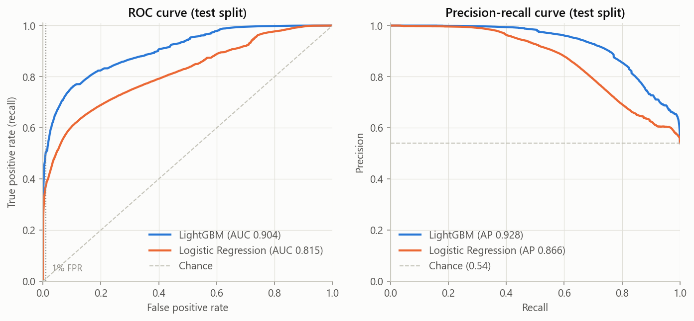
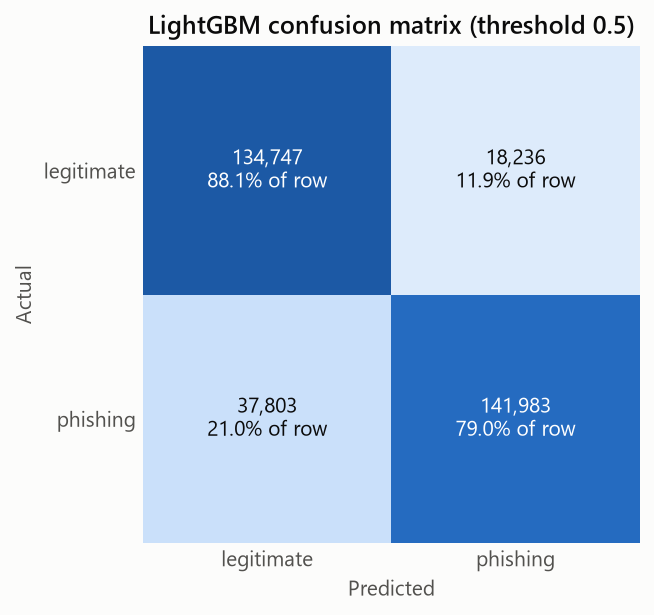
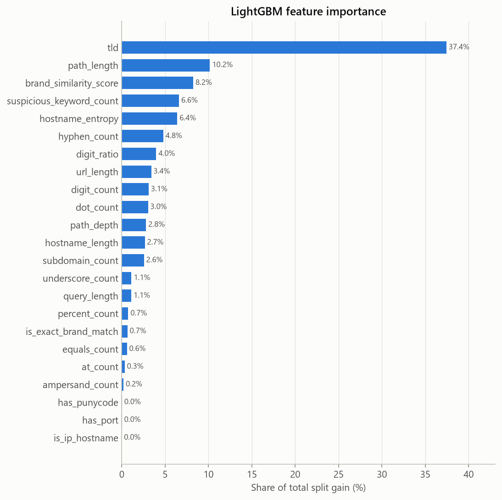

# Model Report - Phishing URL Detector

Feature table: `data/processed/features.parquet` (from `scripts/extract_features.py`)

## Summary of findings

- Train/test split is by registrable domain: 1275007 train rows (653644 domains) vs 332769 test rows (163412 domains), with no domain on both sides. Phishing share: 50.80% train, 54.03% test.
- LightGBM (test): ROC-AUC 0.9038, PR-AUC 0.9276, F1 0.8250 (precision 0.8628, recall 0.7904) at threshold 0.5. At a 1% false-positive rate it catches 50.62% of phishing URLs.
- Logistic Regression baseline (test): ROC-AUC 0.8155, PR-AUC 0.8659, F1 0.7365, recall at 1% FPR 37.21%.
- Probability error (test, lower is better): LightGBM MAE 0.2327, RMSE 0.3549, log loss 0.3826; Logistic Regression MAE 0.3235, RMSE 0.4171, log loss 0.5100.
- At threshold 0.5, LightGBM misses 37684 of 179786 phishing URLs and flags 22596 of 152983 legitimate URLs (14.77%).
- Weakest source for LightGBM by F1: mitake (F1 0.7205). Per-source scores are not directly comparable: each source has a very different phishing share.
- Ablation: adding `has_protocol`/`uses_https` back moves test ROC-AUC from 0.9038 to 0.9241 and recall at 1% FPR from 50.62% to 56.07%. Those flags mostly record how each source formatted its URLs, so any gain from them would not carry over to real traffic. They are left out of the saved models.
- Top features by split gain: `tld` (43.4%), `path_length` (9.4%), `hostname_entropy` (6.4%), `hyphen_count` (6.4%), `suspicious_keyword_count` (6.1%).

## Setup

- Split: `GroupShuffleSplit` on `domain`, test size 0.2, random_state 42.
- Features (21): `url_length`, `hostname_length`, `path_length`, `query_length`, `dot_count`, `hyphen_count`, `digit_count`, `at_count`, `underscore_count`, `percent_count`, `equals_count`, `ampersand_count`, `digit_ratio`, `subdomain_count`, `path_depth`, `is_ip_hostname`, `has_port`, `has_punycode`, `suspicious_keyword_count`, `tld`, `hostname_entropy`.
- Not used as features: `url` (identifier), `label` (target), `domain` (grouping key), `source` (provenance; a shortcut to the label), `has_protocol` and `uses_https` (source-formatting artifacts - see ablation).
- `tld` is categorical. TLDs seen fewer than 100 times in train are pooled into `(other)`, and a missing suffix is `(none)` (250 categories in total).
- Logistic Regression: log1p + standard scaling on numeric features, one-hot `tld`.
- LightGBM: learning rate 0.1, row/column subsampling 0.8. The grid below was scored by 3-fold `GroupKFold` on the train split (grouped by `domain`), with early stopping after 50 rounds. The final model was refit on all of train with the best config and its mean best iteration.

## LightGBM tuning (CV on train split)

|   num_leaves |   min_child_samples |   cv_pr_auc_mean |   cv_pr_auc_std |   best_iteration_mean |
|-------------:|--------------------:|-----------------:|----------------:|----------------------:|
|           31 |                  20 |           0.9324 |          0.011  |                   354 |
|          127 |                  50 |           0.9317 |          0.0149 |                   147 |
|          255 |                 100 |           0.9319 |          0.0149 |                    90 |

Selected: {'num_leaves': 31, 'min_child_samples': 20, 'n_estimators': 354}

## Test results

Threshold-based metrics use threshold 0.5. `recall_at_1pct_fpr` is the share of phishing URLs caught when 1% of legitimate URLs are flagged. `mae`, `mse_brier`, `rmse` and `log_loss` compare the predicted phishing probability with the 0/1 label (lower is better); `mse_brier` is the Brier score and `rmse` its square root.

|                                                 |   precision |   recall |     f1 |   accuracy |    mae |   mse_brier |   rmse |   log_loss |   roc_auc |   pr_auc |   recall_at_1pct_fpr |
|:------------------------------------------------|------------:|---------:|-------:|-----------:|-------:|------------:|-------:|-----------:|----------:|---------:|---------------------:|
| LightGBM                                        |      0.8628 |   0.7904 | 0.8250 |     0.8189 | 0.2327 |      0.1260 | 0.3549 |     0.3826 |    0.9038 |   0.9276 |               0.5062 |
| Logistic Regression                             |      0.8257 |   0.6647 | 0.7365 |     0.7430 | 0.3235 |      0.1739 | 0.4171 |     0.5100 |    0.8155 |   0.8659 |               0.3721 |
| LightGBM + protocol flags (ablation, not saved) |      0.8562 |   0.8165 | 0.8359 |     0.8268 | 0.2053 |      0.1140 | 0.3376 |     0.3477 |    0.9241 |   0.9413 |               0.5607 |

## LightGBM results by source (test split)

| source        |        rows |   phishing_share |   precision |   recall |     f1 |   accuracy |    mae |   mse_brier |   rmse |   log_loss |   roc_auc |   pr_auc |   recall_at_1pct_fpr |
|:--------------|------------:|-----------------:|------------:|---------:|-------:|-----------:|-------:|------------:|-------:|-----------:|----------:|---------:|---------------------:|
| harisudhan411 |  47605.0000 |           0.8547 |      0.9661 |   0.7732 | 0.8589 |     0.7829 | 0.2570 |      0.1418 | 0.3766 |     0.4168 |    0.8995 |   0.9794 |               0.3845 |
| mitake        | 173555.0000 |           0.3181 |      0.6854 |   0.7593 | 0.7205 |     0.8126 | 0.2403 |      0.1316 | 0.3628 |     0.3992 |    0.8860 |   0.8487 |               0.5499 |
| phiusiil      |  40942.0000 |           0.3418 |      0.8173 |   0.6780 | 0.7411 |     0.8381 | 0.2428 |      0.1186 | 0.3443 |     0.3779 |    0.8705 |   0.8451 |               0.5181 |
| semihguner    |  70667.0000 |           0.9891 |      0.9978 |   0.8475 | 0.9165 |     0.8472 | 0.1920 |      0.1057 | 0.3251 |     0.3214 |    0.9049 |   0.9988 |               0.4827 |

## LightGBM confusion matrix (test split)

|                   |   predicted legitimate |   predicted phishing |
|:------------------|-----------------------:|---------------------:|
| actual legitimate |                 130387 |                22596 |
| actual phishing   |                  37684 |               142102 |

## LightGBM feature importance

|                          |   gain_share_pct |
|:-------------------------|-----------------:|
| tld                      |            43.42 |
| path_length              |             9.41 |
| hostname_entropy         |             6.42 |
| hyphen_count             |             6.38 |
| suspicious_keyword_count |             6.07 |
| digit_count              |             4.84 |
| hostname_length          |             3.55 |
| url_length               |             3.41 |
| subdomain_count          |             3.25 |
| digit_ratio              |             3.17 |
| dot_count                |             2.93 |
| path_depth               |             2.67 |
| underscore_count         |             1.34 |
| query_length             |             1.14 |
| percent_count            |             0.78 |
| equals_count             |             0.54 |
| at_count                 |             0.39 |
| ampersand_count          |             0.24 |
| has_punycode             |             0.05 |
| has_port                 |             0.02 |
| is_ip_hostname           |             0.00 |

## Plots

## Caveats

- The four sources overlap and are not independent samples (see `eda_report.md`). Grouping by domain stops the same site from appearing on both sides of the split, but the test split still comes from the same sources as train. Expect lower scores on URLs from a new source.
- Hosting and dynamic-DNS domains (e.g. `blogspot.com`, `duckdns.org`) are one group each, so all of their subdomains fall on the same side of the split.
- Threshold 0.5 was not tuned. Pick the operating point from the ROC curve based on how many false alarms are acceptable.
